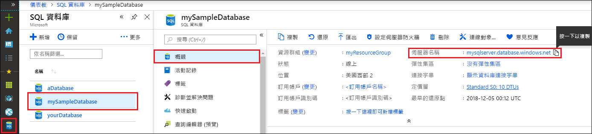

<!-- sql-database-connect-query-prerequisites-server-connection-info-includes.md 

## SQL server connection information
-->

取得連線到 Azure SQL Database 所需的連線資訊。 您在下一個程序中需要完整的伺服器名稱、資料庫名稱和登入資訊。

1. 登入 [Azure 入口網站](https://portal.azure.com/)。

1. 從左側功能表中選取 [SQL Database]，按一下 [SQL Database] 頁面上您的資料庫。

1. 在您資料庫的 [概觀] 頁面上，檢閱如下圖所示的完整伺服器名稱。 您可將滑鼠移至 [伺服器名稱] 上，以帶出 [按一下以複製] 選項。  

   

1. 如果您忘記伺服器登入資訊，您可以按一下 [伺服器名稱] 以瀏覽至 [SQL 伺服器] 頁面並檢視 [伺服器管理員] 名稱。 如有需要，請選取 [重設密碼]。
