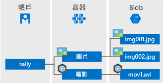

Azure Blob 儲存體是 Microsoft 針對雲端推出的物件儲存體解決方案。 Blob 儲存體已針對儲存大量非結構化物件資料 (例如文字或二進位資料) 最佳化。

Blob 儲存體是適合用於：

* 直接提供映像或文件給瀏覽器。
* 儲存檔案供分散式存取。
* 串流傳輸視訊和音訊。
* 寫入記錄檔。
* 儲存備份和還原、災害復原和封存資料。
* 儲存資料供內部部署或 Azure 託管服務進行分析。

使用者或用戶端應用程式可經由 URL、[Azure 儲存體 REST API](https://docs.microsoft.com/rest/api/storageservices/blob-service-rest-api)、[Azure PowerShell](https://docs.microsoft.com/powershell/module/azure.storage)、[Azure CLI](https://docs.microsoft.com/cli/azure/storage) 或 Azure 儲存體用戶端程式庫，透過 HTTP 或 HTTPS &mdash;從世界各地&mdash; 存取 Blob。 儲存體用戶端程式庫提供多種語言，包括 [.NET](https://docs.microsoft.com/dotnet/api/overview/azure/storage/client)、[Java](https://docs.microsoft.com/java/api/overview/azure/storage/client)、[Node.js](http://azure.github.io/azure-storage-node)、[Python](https://docs.microsoft.com/python/azure/)、[PHP](http://azure.github.io/azure-storage-php/) 和 [Ruby](http://azure.github.io/azure-storage-ruby)。

## Blob 服務概念

Blob 儲存體會公開三個資源：儲存體帳戶、帳戶中的容器以及容器中的 Blob。 下圖顯示資源之間的關係。

### 儲存體帳戶

所有對 Azure 儲存體中資料物件的存取都會透過儲存體帳戶進行。 如需詳細資訊，請參閱 [Azure 儲存體帳戶概觀](../articles/storage/common/storage-account-overview.md?toc=%2fazure%2fstorage%2fblobs%2ftoc.json)。

### 容器

容器會組織一組 Blob，類似於檔案系統中的資料夾。 所有 Blob 都位於容器中。 儲存體帳戶可以包含無限數量的容器，而一個容器則可儲存無限數量的 Blob。 

  > [!NOTE]
  > 容器名稱必須是小寫。

### Blob
 
Azure 儲存體提供三種類型的 Blob&mdash;區塊 Blob、附加 Blob 及[分頁 Blob](../articles/storage/blobs/storage-blob-pageblob-overview.md) (用於 VHD 檔案)。

* 區塊 Blob 可儲存文字和二進位資料 (最多約 4.7 TB)。 區塊 Blob 是由可個別管理的資料區塊所組成。
* 附加 Blob 和區塊 Blob 相似，由區塊所組成，但已針對附加作業最佳化。 附加 Blob 很適合某些案例，例如記錄虛擬機器中的資料。
* 分頁 Blob 可儲存隨機存取檔案 (大小上限為 8 TB)。 分頁 Blob 可儲存用來備份 VM 的 VHD 檔案。

所有 Blob 都位於容器中。 容器類似於檔案系統中的資料夾。 您可以進一步將 Blob 組織成虛擬目錄，並如同檔案系統一樣加以瀏覽。 

在某些情況下，有可能會因為資料集較大和網路受限，而無法透過網路將資料上傳至 Blob 儲存體。 您可以使用 [Azure 資料箱磁碟](../articles/databox/data-box-disk-overview.md)要求 Microsoft 提供固態硬碟 (SSD)。 接著，您可以將資料複製到這些磁碟，並將其寄回給 Microsoft，以上傳至 Blob 儲存體。

如果您需要從儲存體帳戶匯出大量資料，請參閱[使用 Microsoft Azure 匯入/匯出服務將資料傳輸至 Blob 儲存體](../articles/storage/common/storage-import-export-service.md)。
  
如需有關命名容器和 Blob 的詳細資訊，請參閱[命名和參考容器、Blob 及中繼資料](/rest/api/storageservices/Naming-and-Referencing-Containers--Blobs--and-Metadata)。
