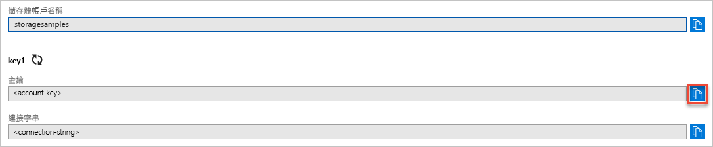

## 從 Azure 入口網站複製您的認證

範例應用程式需要驗證對您儲存體帳戶的存取。 若要進行驗證，您必須以連接字串的形式為應用程式提供您的儲存體帳戶認證。 若要檢視您的儲存體帳戶認證：

1. 瀏覽至 [Azure 入口網站](https://portal.azure.com)。
2. 找出您的儲存體帳戶。
3. 在儲存體帳戶概觀的 [設定] 區段中，選取 [存取金鑰]。 您的帳戶存取金鑰隨即出現，此外也會顯示每個金鑰的完整連接字串。
4. 請記下您的儲存體帳戶名稱，您在驗證時將需要提供此名稱。   
5. 尋找 [金鑰 1] 下方的 [金鑰] 值，然後按一下 [複製] 按鈕以複製帳戶金鑰。

    
