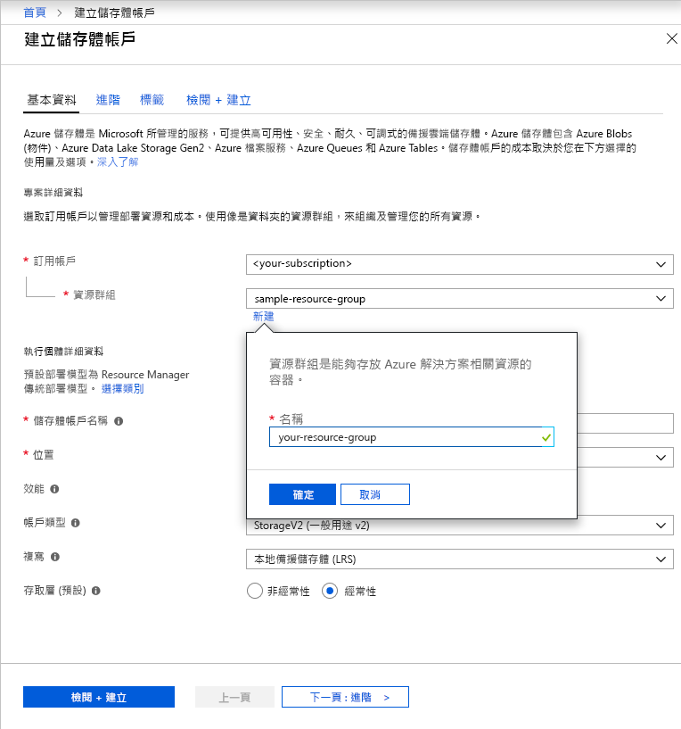

若要在 Azure 入口網站中建立一般用途 v2 儲存體帳戶，請遵循下列步驟：

1. 在 Azure 入口網站中，展開左側功能表以開啟服務的功能表，然後選擇 [所有服務]。 然後，向下捲動至 [儲存體]，然後選擇 [儲存體帳戶]。 在出現的 [儲存體帳戶] 視窗上，選擇 [新增]。
1. 選取要在其中建立儲存體帳戶的訂用帳戶。
1. 在 [資源群組] 欄位下方，按一下 [新建]。 輸入新資源群組的名稱，如下圖所示。

    

1. 接下來，輸入儲存體帳戶的名稱。 您選擇的名稱在 Azure 中必須是唯一的、必須介於 3 到 24 個字元的長度，而且只能包含數字和小寫字母。
1. 選取儲存體帳戶的位置，或使用預設位置。
1. 讓這些欄位設定為其預設值：
    - [部署模型] 欄位預設會設定為 [Resource Manager]。
    - [效能] 欄位預設會設定為 [標準]。
    - [帳戶類型] 欄位預設會設定為 [StorageV2 (一般用途 v2)]。
    - [複寫] 欄位預設會設定為 [本地備援儲存體 (LRS)]。
    - [存取層] 預設會設定為 [經常性存取層]。

1. 按一下 [檢閱 + 建立]，以檢閱您的儲存體帳戶設定並建立帳戶。

如需儲存體帳戶類型及其他儲存體帳戶設定的詳細資訊，請參閱 [Azure 儲存體帳戶概觀](https://docs.microsoft.com/azure/storage/common/storage-account-overview)。 如需資源群組的詳細資訊，請參閱 [Azure Resource Manager 概觀](https://docs.microsoft.com/azure/azure-resource-manager/resource-group-overview)。 
