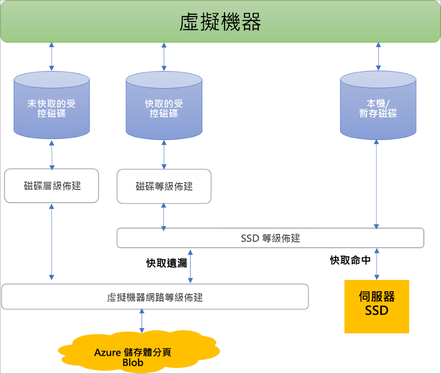
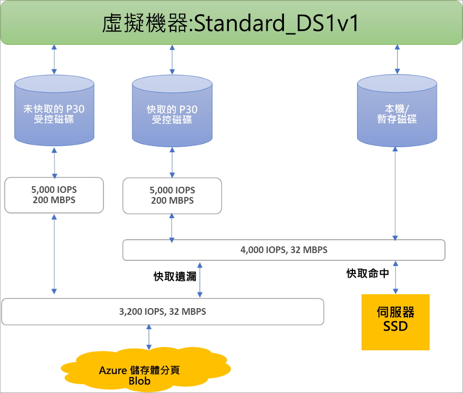

## 受控磁碟的好處

讓我們來複習一下使用受控磁碟時的一些好處。

### 高耐久性及可用性

受控磁碟設計成確保可用性達 99.999%。 受控磁碟達到此目標的方式，是提供三個您資料的複本，而達到高持久性。 如果一個或甚至兩個複本遇到問題，其餘複本有助於確保資料的持續性，以及遇到失敗時的高容錯力。 此結構讓 Azure 針對以基礎結構即服務 (IaaS) 磁碟穩定地展現企業級持久性，提供領先界業的年度零失敗率。

### 簡單且可調整的 VM 部署

您可以使用受控磁碟在每個區域的一個訂用帳戶中建立最多 50,000 個同類型虛擬機器**磁碟**，這可讓您在單一訂用帳戶中建立數千部**虛擬機器**。 這項功能也可讓您使用 Marketplace 映像，在一個虛擬機器擴展集內建立最多 1,000 部虛擬機器，進一步增加[虛擬機器擴展集](../articles/virtual-machine-scale-sets/virtual-machine-scale-sets-overview.md)的延展性。

### 整合可用性設定組

受控磁碟會與可用性設定組整合，以確定[可用性設定組中的虛擬機器](../articles/virtual-machines/windows/manage-availability.md#use-managed-disks-for-vms-in-an-availability-set)磁碟彼此充分隔離，以避免出現單一失敗點。 磁碟會自動放置在不同的儲存體縮放單位 (戳記)。 如果因為硬體或軟體失敗造成戳記失敗，則只有磁碟在這些戳記上的 VM 執行個體才會失敗。 例如，假設您的應用程式在五個 VM 上執行，且這些 VM 位於可用性設定組中。 這些磁碟的 VM 不會全部以相同的戳記儲存，因此，如果有一個戳記失效，應用程式的其他執行個體會繼續執行。

### 整合可用性設定組

受控磁碟支援[可用性區域](../articles/availability-zones/az-overview.md)，這是高可用性供應項目，可保護您的應用程式不受資料中心故障影響。 「可用性區域」是 Azure 地區內獨特的實體位置。 每個區域皆由一或多個配備獨立電力、冷卻系統及網路的資料中心所組成。 若要確保復原能力，在所有已啟用的地區中都至少要有三個個別的區域。 使用「可用性區域」時，Azure 可提供業界最佳的 99.99% VM 執行時間 SLA。

### Azure 備份支援

為了防止發生區域災難，可使用 [Azure 備份](../articles/backup/backup-overview.md)透過時間型備份和備份保留原則，來建立備份作業。 如此即可隨心所欲地執行簡易虛擬機器還原。 目前 Azure 備份支援的磁碟大小上限為四個 TiB 磁碟。  Azure 備份支援受控磁碟的備份和還原。 [深入了解](../articles/backup/backup-support-matrix-iaas.md) Azure VM 備份支援。

### 細微的存取控制

您可以使用 [Azure 角色型存取控制 (RBAC)](../articles/role-based-access-control/overview.md) 將受控磁碟的特定權限指派給一個或多個使用者。 受控磁碟公開各種不同的作業，包括讀取、寫入 (建立/更新)、刪除和擷取磁碟的[共用存取簽章 (SAS) URI](../articles/storage/common/storage-dotnet-shared-access-signature-part-1.md)。 您可以授權某人只能存取他份內工作所需的作業。 例如，如果您不想讓某人將受控磁碟複製到儲存體帳戶，您可以選擇不要授權存取該受控磁碟的匯出動作。 同樣地，如果您不想讓某人使用 SAS URI 來複製受控磁碟，您可以選擇不要授與有關受控磁碟的這種權限。

## 加密

受控磁片提供兩種不同的加密。 第一種是「儲存體服務加密」(SSE)，這會由儲存體服務執行。 第二種是「Azure 磁碟加密」，您可以在您 VM 的作業系統和資料磁碟上啟用它。

### 儲存體服務加密 (SSE)

[Azure 儲存體服務加密](../articles/storage/common/storage-service-encryption.md)提供待用加密，並保護資料安全，以符合組織安全性和合規性承諾。 在所有可用受控磁碟的區域中，所有受控磁碟、快照集和映像預設都會啟用 SSE。 如需詳細資訊，請造訪[受控磁碟常見問題頁面](../articles/virtual-machines/windows/faq-for-disks.md#managed-disks-and-storage-service-encryption)。

### Azure 磁碟加密 (ADE)

Azure 磁碟加密可讓您加密由 IaaS 虛擬機器所使用的作業系統和資料磁碟。 此加密包含受控磁碟。 對於 Windows，磁碟機是使用業界標準的 BitLocker 加密技術來加密。 對於 Linux，磁碟是使用 DM-Crypt 技術來加密。 加密程序會與 Azure Key Vault 整合，可讓您控制和管理磁碟加密金鑰。 如需詳細資訊，請參閱 [IaaS 虛擬機器適用的 Azure 磁碟加密](../articles/security/azure-security-disk-encryption-overview.md)。

## 磁碟角色

Azure 中有三個主要磁碟角色：資料磁碟、OS 磁碟和暫存磁碟。 這些角色對應至您的虛擬機器連結的磁碟。

### 資料磁碟

資料磁碟是連接至虛擬機器的受控磁碟，用來儲存應用程式資料或其他您需要保留的資料。 資料磁碟註冊為 SCSI 磁碟機，並以您選擇的字母標示。 每個資料磁碟都有 32,767 GiB 的容量上限。 虛擬機器的大小會決定您可以連接之磁碟的數量，以及您可以用來裝載磁碟的儲存體類型。

### 作業系統磁碟

每個虛擬機器都有一個連接的作業系統磁碟。 作業系統磁碟有預先安裝作業系統，在建立虛擬機器時即已選取。

此磁碟的最大容量為 2,048 GiB。

### 暫存磁碟

每個虛擬機器皆包含一個暫存磁碟，此非受控磁碟。 暫存磁碟為應用程式和處理程序提供短期的儲存空間，且僅供用來儲存分頁檔之類的資料。 暫存磁碟上的資料可能會在[維護事件](../articles/virtual-machines/windows/manage-availability.md?toc=%2fazure%2fvirtual-machines%2fwindows%2ftoc.json#understand-vm-reboots---maintenance-vs-downtime)期間或當您[重新佈署虛擬機器](../articles/virtual-machines/troubleshooting/redeploy-to-new-node-windows.md?toc=%2Fazure%2Fvirtual-machines%2Fwindows%2Ftoc.json)時遺失。 在 Azure Linux VM 上，暫存磁碟預設為 /dev/sdb，而在 Windows VM 上，暫存磁碟預設為 D:。 在 VM 的成功標準重新開機期間，暫存磁碟上的資料將保留。

## 受控磁碟快照集

受控磁碟快照集是受控磁碟的絕對一致完整唯讀複本，預設會儲存為標準受控磁碟。 快照集可讓您在任何時間點備份受控磁碟。 這些快照集可在來源磁碟外獨立存在，還能用來建立新的受控磁碟。 

快照集會根據使用的大小來計費。 例如，如果建立佈建容量為 64 GiB 的受控磁碟快照集，而實際使用資料大小為 10 GiB，則只會對已使用的 10 GiB 資料大小收取快照集費用。 您可以藉由檢查 [Azure 使用量報表](https://docs.microsoft.com/en-us/azure/billing/billing-understand-your-bill)來查看已使用的快照大小。 例如，如果已使用的快照集資料大小為 10 GiB，使用量報表會顯示 10 GiB/(31 天 x 24 小時) = 0.013441 GiB 作為已使用的數量。

若要深入了解如何建立受控磁碟的快照集，請參閱下列資源︰

* [在 Windows 中建立 VHD 複本並儲存為受控磁碟](../articles/virtual-machines/windows/snapshot-copy-managed-disk.md)
* [在 Linux 中建立 VHD 複本並儲存為受控磁碟](../articles/virtual-machines/linux/snapshot-copy-managed-disk.md)

### 映像

受控磁碟也支援建立受管理的自訂映像。 您可以從儲存體帳戶中的自訂 VHD 或直接從一般化 (系統預備的) 虛擬機器建立映像。 此程序會擷取單一映像。 此映像包含與虛擬機器相關聯的所有受控磁碟，包括作業系統和資料磁碟。 這個受控自訂映像可讓您使用自訂映像建立數百部虛擬機器，而不需要複製或管理任何儲存體帳戶。

如需建立映像的詳細資訊，請參閱下列文章︰

* [在 Azure 中如何擷取一般化 VM 的受控映像](../articles/virtual-machines/windows/capture-image-resource.md)
* [如何使用 Azure CLI 將 Linux 虛擬機器一般化並加以擷取](../articles/virtual-machines/linux/capture-image.md)

#### 映像與快照集的比較

請務必了解映像和快照集之間的差異。 受控磁碟可讓您為已解除配置的一般化虛擬機器建立映像。 此映像包含所有附加至虛擬機器的磁碟。 您可以使用此映像建立虛擬機器，它會包含所有磁碟。

快照集是在建立快照當下的磁碟複本， 只適用於一個磁碟。 如果您的虛擬機器有一個磁碟 (作業系統磁碟)，您可以建立它的快照集或映像，然後從快照集或映像建立虛擬機器。

快照集只會感知到本身包含的磁碟，對其他任何磁碟一概不知。 若要在需要協調多個磁碟的情況下 (例如等量分割) 使用，這會出現問題。 快照集必須能夠彼此協調，但目前不支援。

## 磁碟配置和效能

下圖使用三層佈建系統，說明進行磁碟的頻寬和 IOPS 即時配置：

第一層佈建會設定每個磁碟的 IOPS 和頻寬指派。  在第二層，計算伺服器主機會實作 SSD 佈建，只將它套用至伺服器 SSD 上儲存的資料，包括具有快取 (ReadWrite 和 ReadOnly) 的磁碟，以及本機和暫存磁碟。 最後，VM 網路佈建會針對計算主機傳送到 Azure 儲存體後端的任何 I/O 在第三層進行。 使用此配置時，VM 的效能取決於各種不同的因素，包括 VM 如何使用本機 SSD、連結的磁碟數目，以及其所連結磁碟的效能和快取類型。

在這些限制的範例中，Standard_DS1v1 VM 因為 SSD 和網路層級的限制而無法達到 P30 磁碟的 5,000 IOPS 潛能 (不論是否快取)：

Azure 會針對磁碟流量使用依優先順序的網路通道，其優先順序高於其他低優先順序的網路流量。 這可協助磁碟在網路爭用的情況下維持其預期的效能。 同樣地，Azure 儲存體會使用自動負載平衡來處理背景中的資源爭用和其他問題。 當您建立磁碟時，Azure 儲存體會配置所需的資源，並套用資源的主動式和回應式平衡來處理流量層級。 這可進一步確保磁碟可維持其預期的 IOPS 和輸送量目標。 您可以視需要使用 VM 層級和磁碟層級計量來追蹤效能和設定警示。

請參閱我們的[高效能設計](../articles/virtual-machines/windows/premium-storage-performance.md)一文，以了解最佳化 VM 和磁碟組態的最佳作法，以便您達到所需的效能

## 後續步驟

請參閱磁碟類型的相關文章，深入了解 Azure 提供的各種磁碟類型，找出何種類型最符合您的需求，以及了解其效能目標。
